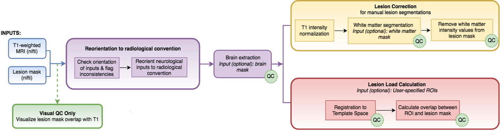
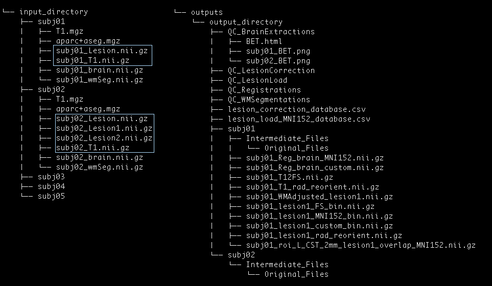

# Pipeline for Analyzing Lesions after Stroke (PALS) #


Welcome to our github page!

## What is PALS?

[PALS](https://www.frontiersin.org/articles/10.3389/fninf.2018.00063/full) is a scalable and user-friendly toolbox designed to facilitate standardized analysis and ensure quality in stroke research using T1-weighted MRIs. The PALS toolbox offers four moduels integrated into a single pipeline, including (1) reorientation to radiological convention, (2) lesion correction for healthy white matter voxels, (3) lesion load calculation, and (4) visual quality control. To learn more, please refer to our [paper in Frontiers](https://www.frontiersin.org/articles/10.3389/fninf.2018.00063/full). 



## Getting Started

There are two ways to use PALS: in a [Docker Container](#docker_instructions) (recommended) or in a [Manually Prepared Environment](#manual_env).

### Docker Container (recommended)
<a id='docker_instructions'></a>

Docker must be installed to run PALS in a Docker container. You can follow instructions from [here](https://docs.docker.com/docker-for-mac/install/) to install the Docker software on your system. Once Docker is installed, follow the instructions below to run PALS.

__NOTE: this requires 10Gb of free space on your hard drive to run__

#### Preparing your directories
1. Gather all subjects on which you want to perform PALS operations into a single data directory. This directory should contain sub-directories with subject ID's for each subject (see [Data Structure](#data_structure)). For example, here we will call this directory `/subjects`.
2. Create another directory which would contain the result files after running PALS on the input subjects. We will call this directory  `/results` in our example.
3. Go to [PALS Config Generator](https://npnl.github.io/ConfigGenerator/), select all the options that apply and download the config file. This step will download a file named `config.json`. __Do not rename this file.__
4. Store the config file in a separate directory. Here, we have moved our config file to our `/settings` directory

#### Running PALS
1. Make sure that your Docker process is already running. You can do this by executing the following command on the terminal.
    ```
    docker run hello-world
    ```
    If you see the following kind of output, then you have a running instance of docker on your machine and you are good to go.
    
    ```
    Unable to find image 'hello-world:latest' locally
    latest: Pulling from library/hello-world
    1b930d010525: Pull complete
    Digest: sha256:2557e3c07ed1e38f26e389462d03ed943586f744621577a99efb77324b0fe535
    Status: Downloaded newer image for hello-world:latest

    Hello from Docker!
    This message shows that your installation appears to be working correctly.
    ... Few more lines...
    ```
2. To run PALS, simply run the following command, __making sure to replace filepaths with your own filepaths__.
    ```
    docker run -it -v <absolute_path_to_directory_containing_input_subjects>:/input/ -v <absolute_path_to_the output_directory>:/output/ -v <absolute_path_to_directory_containing_config_file>:/config/ amitasviper/pals:stable -d
    ```
    
    For example, with the configuration file created in the [Preparation](#preparing-your-directories) step, the command to run PALS would be given as follows.
    
    ```
    docker run -it -v /subjects:/input/ -v /results:/output/ -v /settings:/config/ amitasviper/pals:stable -d
    ```
    
    Note: Make sure you do not change the `:/input/` or `:/output/` or `:/config/` parts in the command!
  
  3. That's it! You can find the outputs from PALS in the output directory you specified in [Preparation](#preparing-your-directories) step #2!


### Manually Prepared Environment
<a id='manual_env'></a>

__Prerequisites__

* Linux or Mac OS
* [Python 2.7](https://www.python.org/download/releases/2.7/)
* [pip](https://pip.pypa.io/en/stable/installing/)
* [FSL](https://fsl.fmrib.ox.ac.uk/fsl/fslwiki/FslInstallation)
  * If using a version of FSL older than 5.0.10, separate installion of [FSLeyes](https://fsl.fmrib.ox.ac.uk/fsl/fslwiki/FSLeyes) is necessary.
* [FreeSurfer](https://surfer.nmr.mgh.harvard.edu/fswiki/DownloadAndInstall)

First-time users may be asked to specify a directory path to FSL and/or FreeSurfer binaries (see instructions for [FSL](https://fsl.fmrib.ox.ac.uk/fsl/fslwiki/FslInstallation/ShellSetup) and [FreeSurfer](https://surfer.nmr.mgh.harvard.edu/fswiki/MacOsInstall#SetupandConfiguration) setup).

__Installing__

Clone this github repository:

```
git clone https://github.com/npnl/PALS.git
```

Install `python-tk`
```
sudo apt-get install python-tk
```

Install python dependencies
```
cd PALS
pip install -r requirements.txt
```
---

__Run__
Open up your terminal and navigate to the directory containing PALS source code.

```
cd /PATH/TO/PALS
python2.7 run_pals.py
```
This will open up the PALS GUI.

To use PALS, the user must first use a method of their choice to generate initial lesion masks for their dataset.

## Data Structure
<a id='data_structure'></a>



### Inputs

__Required:__  
PALS requires the user to provide an Input Directory with separate Subject Directories containing:

* Subject's T1-weighted anatomical image file (nifti)
* Subject's lesion mask file (nifti)

__Optional:__
* Subject's skull-stripped brain file (nifti)
* Subject's white matter segmentation file (nifti)
* Subject's FreeSurfer T1 file (T1.mgz)
* Subject's FreeSurfer cortical/subcortical parcellation file (aparc+aseg.mgz)

### Outputs

PALS output files and directories will vary depending on the options selected (e.g., *QC_BrainExtractions* for the brain extraction step.)

__QC Directories__  
  A new quality control directory will be created for each intermediary step taken. Each QC directory will contain screenshots for each subject, and a single HTML page for easy visual quality inspection.

__Subject Directories__  
A separate directory will be created for each subject, each of which will contain a __*Intermediate_Files*__ subdirectory.

* __*Intermediate_Files*__ will store all outputs from intermediary processing steps. __*Intermediate_Files*__ will also contain a subdirectory called __*Original_Files*__.

* __*Original_Files*__ will contain a copy of all input files for that subject.

outputs from __reorient__ module:   
>__subjX_T1_rad_reorient.nii.gz__ - subject's original T1 brain file in radiological convention  
>__subjX_lesion1_rad_reorient.nii.gz__ - subject's original lesion mask in radiological convention

outputs from __lesion correction__ module:  
>__subjX_WMAdjusted_lesion1.nii.gz__ - subject's corrected lesion mask with white matter voxels removed

outputs from __lesion load__ module:  
>__subjX_Reg_Brain_MNI.152.nii.gz__ - subject's brain registered to MNI space  
>__subjX_Reg_Brain_custom.152.nii.gz__ - subject's brain registered to user-input template space  
>__subjX_T12FS.nii.gz__ - subject's brain registered to FreeSurfer space  
>__subjX_lesion1_MNI152_bin.nii.gz__ - subject's first lesion mask registered to MNI space  
>__subjX_lesion1_custom_bin.nii.gz__ - subject's first lesion mask registered to user-input template space   
>__subjX_lesion1_FS_bin.nii.gz__ - subject's first lesion mask registered to FreeSurfer space  
>__subjX_roi_name_lesion1_overlap.nii.gz__ - subject's lesion-ROI overlap file (one for each ROI)

__Databases__:
For the lesion correction and lesion load calculation modules, separate CSV files will be created, containing information for all subjects about number of voxels removed and amount of lesion-roi overlap, respectively.


---
### Troubleshooting
###### Problem 1.
On Mac OS X, Nipype.workflow fails with the error : `ValueError: unknown locale: UTF-8`.
###### Solution. 
If you are facing the above mentioned error on MacOS X, here's the quick fix - add these lines to your ~/.bash_profile or simply execute then in your terminal from where you are running the PALS software.:
```
export LC_ALL=en_US.UTF-8
export LANG=en_US.UTF-8
```


###### Problem 2.
Pip fails with the error `Could not find a version that satisfies the requirement nypipe`.
###### Solution.
Run the following command to upgrade the pip.
1. If you are using Python 2.x
`curl https://bootstrap.pypa.io/get-pip.py | python`
2. If you are using Python 3.x
`curl https://bootstrap.pypa.io/get-pip.py | python3`


---
### Support

The best way to keep track of bugs or failures is to open a [New Issue](https://github.com/npnl/PALS/issues/new) on the Github system. You can also contact the author via email: kaoriito at usc dot edu.

---

### Referencing

Please reference our overview paper when using PALS:

*Ito, K. L., Kumar, A., Zavaliangos-Petropulu, A., Cramer, S. C., & Liew, S. L. (2018). Pipeline for Analyzing Lesions After Stroke (PALS). Frontiers in neuroinformatics, 12, 63.*

### Authors

* **Kaori Ito** - [Github](https://github.com/kaoriito)
* **Amit Kumar** - [Github](https://github.com/amitasviper)


### License

This project is licensed under the GNU General Public License - see the [LICENSE.md](LICENSE.md) file for details

<!-- ## Acknowledgments

* Hat tip to anyone who's code was used
* Inspiration
* etc -->
