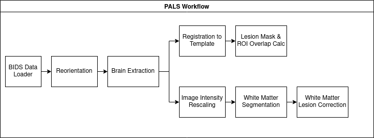

# Pipeline for Analyzing Lesions after Stroke (PALS)
## Contents
1. [Introduction](#intro).
2. [Expected Data Structure](#datastructure)  
3. [Getting started](#start)  
  3.1. [Direct use](#direct)  
  3.2. [Singularity](#singularity)
   
4. [PALS Configuration File](#config)
5. [Running PALS](#running)

## What is PALS?<a name=intro></a>
PALS is a pipeline for reliably preprocessing images of subjects with stroke lesions. The pipeline is implemented using [Nipype](https://nipype.readthedocs.io/en/latest/), with several modules:
- Reorientation to radiological convention (LAS, left is right)
- Lesion correction for healthy white matter
- Lesion load calculation by ROI

Here is a visualization of the workflow:  


For additional information about the original implementation, see the publication in [Frontier in Neuroinformatics](https://www.frontiersin.org/articles/10.3389/fninf.2018.00063/full).

## Expected Data Structure<a name=datastructure></a>
PALS expects its input data to be [BIDS-compatible](https://bids-specification.readthedocs.io/en/stable/) but does not expect any particular values for the BIDS entities. You will need to modify the [configuration file](#config) to set "LesionEntities" and "T1Entities" to match your data. Outputs are provided in BIDS derivatives.

## Getting Started<a name=start></a>
There are two ways to use PALS: directly via the pals_workflow.py Python code, or by using the Singularity definition file provided. 

### Preparation for direct use<a name=start></a>
PALS is implemented in Python 3.8; you will first need to install Python. We recommend that you also install the Python virtual environment.

You can install PALS using:
`pip install -U https://github.com/npnl/PALS`  

You will also need to install the following software packages on your machine. This is the full list of required neuroimaging packages:
- [FSL](https://fsl.fmrib.ox.ac.uk/fsl/fslwiki)
  - For running FLIRT and FAST.
  
Note that if your intended pipeline won't use components that are dependent on a particular package, it does not need to be installed. E.g., if you plan to use FLIRT for registration, you don't need to install ANTs.

Lastly, you will need to update the configuration settings (`config.json`) to specify your settings. See [this section](#config) for how to do so.

### Preparation for Singularity<a name=singularity></a>
You will first need to download the PALS code: `git clone https://github.com/npnl/PALS`  
[Singularity](https://sylabs.io/guides/3.9/user-guide/quick_start.html#quick-installation-steps) also needs to be installed on your system.

Using the provided Singularity file `pals_singularity.def`, you can build the image using:  
`sudo singularity build pals_singularity.sif pals_singularity.def`

Lastly, you will need to update the configuration settings (`config.json) to specify your settings. See [this section](#config) for how to do so.

## PALS Configuration File<a name=config></a> 
PALS can be configured to run similar pipelines that differ in their implementations. Here is the default `config.json`, with explanations of each variable:  
```
config.json

{
 "Analysis": {
  "Reorient": true,                             # bool; Whether to standardize the orientation (e.g. radiological, neurological).
  "Orientation": "LAS",                         # str; Orientation to standardize to.
  "Registration": true,                         # bool; Whether to perform registration to a common template.
  "RegistrationMethod": "FLIRT",                # str; Registration method.
  "BrainExtraction": true,                      # bool; Whether to perform brain extraction.
  "BrainExtractionMethod": "BET",               # str; Method to use for brain extraction.
  "WhiteMatterSegmentation": true,              # bool; Whether to do white matter segmentation.
  "LesionCorrection": true,                     # bool; Whether to perform lesion correction.
  "LesionLoadCalculation": true                 # bool; Whether to compute lesion load.
 },
 "Outputs": {
  "Root": "/data1/pals/",                       # str; Path to directory where to place the output.				        
  "LesionLoadDatabase": "pals_lesionload.db",   # str
  "LesionLoadTableName": "LESION",              # str
  "StartRegistrationSpace": "MNI152NLin2009aSym",	# str; Value to use for "space" entity in BIDS output filename. 
  "RegistrationTransform": "",                  # str; Optional. Path for saving registration transform. 
  "Reorient": "",					            # str; Optional. Path for saving reoriented volume.
  "BrainExtraction": "",                        # str; Optional. Path for saving the brain extracted volume.
  "LesionCorrected": ""                         # str; Optional. Path for saving the white matter-corrected lesions.
 },
 "BrainExtraction": {                           # Settings to pass to brain extraction; structure depends on Analysis['BrainExtractionMethod']
  "frac": 0.5,
  "mask": true
 },
 "Registration": {                              # Settings to pass to registration; structure depends on Analysis['RegistrationMethod']
  "cost_func": "normmi",
  "reference": "/data1/mni_icbm152_t1_tal_nlin_sym_09a_brain.nii",
  "no_search": false
 },
 "LesionCorrection": {                          # Settings for white matter correction.
  "ImageNormMin": 0,                            # Minimum value for image.
  "ImageNormMax": 255,                          # Maximum value for image
  "WhiteMatterSpread": 0.05                     # The deviation of the white matter intensity as a fraction of the mean white matter intensity.
 },
 "BIDSRoot": "/data1/data",                     # str; Path to the BIDS root directory for the raw data.
 "Subject": "",                                 # str; ID of the subject to run. If blank, runs all subjects.
 "Session": "",                                 # str; ID of the session to run. If blank, runs all sessions.
 "LesionRoot": "/data1/",                       # str; Path to the BIDS root directory for the lesion masks.
 "LesionEntities": {                            # BIDS entity:value pairs for identifying the lesion files. 
  "suffix": "mask",
  "space": "MNI152NLin2009aSym",
  "label": "L"
 },
 "T1Entities": {                               # BIDS entity:value pairs for identifying the T1 images.
  "desc": "T1FinalResampledNorm",
  "space": "MNI152NLin2009aSym"
 },
 "ROIDir": "ROIs",                             # str; Path to the directory containing ROI image files.
 "ROIList": [],                                # list; List of ROI files to use.
 "Multiprocessing": 16                         # int; Number of threads to use for multiprocessing. Has no effect unless more than 1 subject is being processed.
}
```

## Running PALS<a name=running></a>
Once the configuration file is set, you can run PALS from the command line:  
For direct use:  
`PALS -h`  
`PALS --config config.json`  
  
For Singularity, with the image pals_singularity.sif:  
`singularity run pals_singularity.sif -h`  
`singularity run pals_singularity.sif --config config.json`

PALS will parse the configuration file, apply the desired pipeline, then return the output in a BIDS directory specified by info in the 'Outputs' section of the config file.
The precise output will depend on the analysis flags you set, but here is a list of the output files you would typically expect:  
- `graph.png`, `graph_detailed.png`  
  - Visual representation of the pipeline used to generate the data.
- `sub-X_ses-Y_desc-LAS_T1w.nii.gz`  
  - The input data reoriented to LAS. "LAS" will change to match your requested orientation.
- `sub-X_ses-Y_desc-LesionLoad.csv`
  - A .csv file containing the lesion load in each of the requested regions of interest. Units are in voxels.
- `sub-X_ses-Y_space-SPACE_desc-CorrectedLesion_mask.nii.gz`  
  - The lesion mask after white matter correction; note that the quality of the mask depends on the quality of the white matter segmentation.
- `sub-X_ses-Y_space-SPACE_desc-transform.mat`
  - Affine matrix for the transformation used to register the subject images.
- `sub-X_ses-Y_space-SPACE_desc_WhiteMatter_mask.nii.gz`
  - White matter mask generated by the white matter segmentation.
  
Placeholder values:
- X: subject ID
- Y: session ID
- SPACE: String indicating the space the image is in (e.g. MNI152NLin2009aSym)